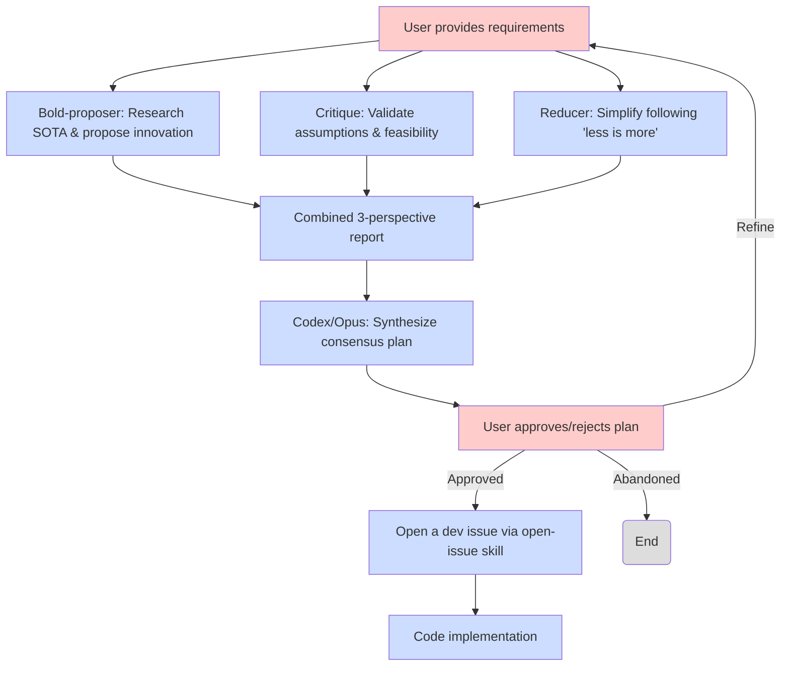

# AI-powered SDK for Software Development

## Quick Start

1. Clone this repository:
```bash
git clone https://github.com/SyntheSys-Lab/agentize.git
```
2. Use this repository to create an SDK for your project.
```
make agentize \
   AGENTIZE_PROJECT_NAME="your_project_name" \
   AGENTIZE_PROJECT_PATH="/path/to/your/project" \
   AGENTIZE_PROJECT_LANG="c" \
   AGENTIZE_MODE="init"
```

This will create an initial SDK structure in the specified project path.
For more details of the variables and options available, refer to our
[usage document](./docs/options.md).

## Core Phylosophy

1. Plan first, code later: Use AI to generate a detailed plan before writing any code.
   - Plan is put on Github Issues for tracking.
2. Build [skills](https://agentskills.io/).
   - Skills are modular reusable, formal, and lightweighted flow definitions.
   - This is something like C-style declaration and implementation separation.
     - `/commands` are declarations and interfaces for users to invoke skills.
     - `/skills` are implementations of the skills.
3. Bootstrapping via self-improvment: We have `.claude` linked to our `claude` rules
   directory. We use these rules to develop these rules further.
   - Top-down design: Start with a high-level view of the development flow.
   - Bottom-up implementation: Implement each aspect of the flow from bottom, and finally
     integrate them together.

### Workflow:

`/ultra-planner` command flow (multi-agent debate-based planning):


`/issue2impl` command flow:


**Legend**
- Red boxes: user interventions, including providing development
requirements, approving/rejecting results (both intermediate and final),
and starting new development sessions.
- Blue boxes: automated steps performed by AI agents/skills/commands.

## Tutorials

Learn Agentize in 15 minutes with our step-by-step tutorials (3-5 min each):

1. **[Initialize Your Project](./docs/00-initialize.md)** - Set up Agentize in new or existing projects
2. **[Plan an Issue](./docs/01-plan-an-issue.md)** - Create implementation plans and GitHub issues
3. **[Ultra Planner](./docs/01b-ultra-planner.md)** - Multi-agent debate-based planning for complex features
4. **[Issue to Implementation](./docs/02-issue-to-impl.md)** - Complete development cycle with `/issue-to-impl`, `/code-review`, and `/sync-master`
5. **[Advanced Usage](./docs/03-advanced-usage.md)** - Scale up with parallel development workflows

## Project Organization

```plaintext
agentize/
├── docs/                   # Document
│   ├── draft/              # Draft documents for local development
│   ├── OPTIONS.md          # Document for make options
│   └── git-msg-tags.md     # Used by \commit-msg skill and command to write meaningful commit messages
├── templates/              # Templates for SDK generation
├── claude/                 # Core agent rules for Claude Code
├── tests/                  # Test cases
├── .gitignore              # Git ignore file
├── Makefile                # Makefile for creating SDKs
└── README.md               # This readme file
```
