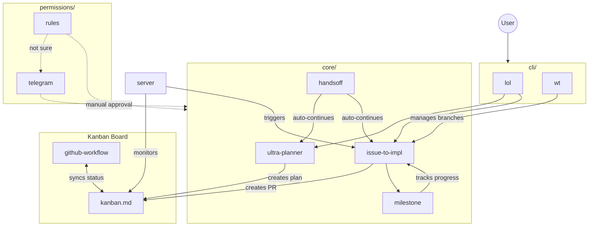

# Workflow Diagrams

This folder describes the major features of Agentize, including:

- `core/`: AI agent development workflows, including planning and implementation.
  - `ultra-planner.md`: The Ultra Planner agent that creates detailed plans from high-level goals.
  - `mega-planner.md`: The Mega Planner with 5-agent dual-proposer debate and external AI synthesis.
  - `issue-to-impl.md`: The Issue to Implementation agent that converts plan items into code.
  - `milestone.md`: The milestone workflow for implementing large features incrementally with progress tracking.
  - `handsoff.md`: The stop hook that feeds back the progress to continue on both workflows above automatically.
- `permissions/`: Permission management workflows, including requesting, granting, and revoking permissions.
  - `rules.md`: Rule based permission management.
  - `telegram.md`: If rules fails to grant permission, send a message to Telegram for manual approval.
- `kanban.md`: Viewboard management using GitHub Project V2.
  - `github-workflow.md`: GitHub Actions to sync the kanban with the progress of plans and implementations.
  - Each plan created by `core/ultra-planner.md` will be represented as an entry on the viewboard.
  - Each PR executed from plans by `core/issue-to-impl.md` will be represented as an entry on the viewboard.
- `server.md`: A server runs on your local machine to look at the kanban to execute the plans automatically.
- `cli/`: Command Line Interface to interact with the features above.
  - `lol`: Play with the SDK powered by Agentize!
  - `wt`: Git worktree wrappers

